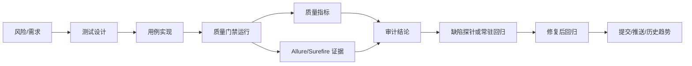

# 审计链路设计

> 目标：让每一次新增测试、每一次运行、每一个缺陷探针，都能回答“为什么测、测了什么、证据在哪里、对应哪个提交、后续如何回归”。

## 1. 审计对象

| 对象 | 说明 | 当前载体 |
|---|---|---|
| 风险 | 业务或工程风险，例如并发超发、越权、数据漂移 | `test-roadmap.md`、`06-historical-badcases.md` |
| 用例 | 风险的可执行验证 | JUnit 类/方法、Allure 注解 |
| 数据 | 用例构造的测试态与清理策略 | `fixture`、`DataIntegrityTest`、`DataMaintenanceTest` |
| 运行 | 某次测试执行的结果 | `quality-metrics.json`、`quality-history.jsonl`、Surefire XML |
| 证据 | HTTP 请求响应、DB 副作用、失败消息 | Allure attachments、断言消息、DB 复核 |
| 缺陷 | 被测系统真实问题 | `@KnownDefect`、`@Issue("Rn")`、`06-historical-badcases.md` |
| 变更 | 测试资产或缺陷修复对应提交 | `gitCommit`、提交信息、PR/CI 记录 |

## 2. 标准链路



任何新增链路至少要能串起：

```text
risk -> test class/method -> data strategy -> run id -> evidence -> result -> commit
```

若发现真实缺陷，则链路扩展为：

```text
risk -> failing probe -> defect id(Rn) -> known defect registry -> skipped gate -> fix -> regression
```

## 3. 标识规范

| 标识 | 格式 | 示例 | 用途 |
|---|---|---|---|
| 风险编号 | `RISK-<domain>-<topic>` | `RISK-COUPON-CONCURRENT-CLAIM` | 设计阶段识别风险 |
| 缺陷编号 | `R<n>` | `R9` | 已实测产品缺陷 |
| 用例标识 | `<Class>#<method>` | `CouponLifecycleAdminApiTest#concurrent_claim_should_not_over_issue_coupon` | 报告、缺陷、历史关联 |
| 运行标识 | `<timestamp>-<suite>-<shortSha>` | `20260713T194329-fast-c53331a` | 单次门禁运行 |
| 数据标识 | 前缀 + 场景 + 时间/纳秒 | `TEST-ADMIN-COUPON-concurrent-*` | 清理与定位 |

当前 `run-quality-gate.ps1` 已输出 `runId`、`ciBuildId`、`gitCommit`、`gitBranch`、`runStartedAt`、`runFinishedAt`、`suite`、`testFilter`、`knownDefectIds`、`knownDefectCases`。后续接 CI 时，直接传入 `-CiBuildId` 或使用常见 CI 环境变量即可进入指标文件。

## 4. 用例审计要求

新增任一用例必须在代码或文档中留下这些信息：

| 要求 | 做法 |
|---|---|
| 业务意图 | `@DisplayName` 写清“动作 + 预期” |
| 链路归属 | `@Epic/@Feature/@Story` |
| 责任归属 | `@Owner` |
| 风险等级 | `@Severity` |
| 缺陷追溯 | 已知缺陷加 `@KnownDefect` + `@Issue("Rn")` |
| 数据策略 | 类注释或 fixture 方法说明清楚创建/回收方式 |
| oracle 来源 | 断言消息或文档说明 DB/源码/接口契约来源 |

推荐类注释结构：

```java
/**
 * P1 · 业务链路：验证什么风险。
 * 风险：RISK-XXX。
 * 数据策略：如何创建、如何清理、是否触碰共享种子。
 * 审计证据：接口响应 + DB 副作用 + Allure 附件。
 */
```

## 5. 缺陷审计链路

当用例发现产品缺陷时，必须按以下顺序收口：

1. 保留按“正确行为”书写的失败断言。
2. 实跑一次，记录失败事实。
3. 在 `context-pack/06-historical-badcases.md` 增加 `Rn`：
   - 症状
   - 根因推断
   - 源码证据
   - 测试证据
4. 用例加 `@KnownDefect("Rn: ...")` 和 `@Issue("Rn")`。
5. 覆盖矩阵 `test-coverage.md` 增加缺陷探针行。
6. 默认门禁确认跳过且全绿。
7. SUT 修复后，删除 `@KnownDefect`，保留 `@Issue` 或迁移为普通回归说明。

R9 就是当前样板：

```text
风险：优惠券限量并发领取
用例：CouponLifecycleAdminApiTest#concurrent_claim_should_not_over_issue_coupon
事实：发行数量 1，12 并发成功 2 次
缺陷：R9
门禁：默认 skipped，不阻断 fast
```

## 6. 运行审计链路

默认门禁运行：

```powershell
cd mall-api-test
powershell -ExecutionPolicy Bypass -File tools/run-quality-gate.ps1
# CI 可显式传构建号：
powershell -ExecutionPolicy Bypass -File tools/run-quality-gate.ps1 -CiBuildId $env:GITHUB_RUN_ID
```

每次运行至少归档：

| 产物 | 审计价值 |
|---|---|
| `target/quality-metrics.json` | 本次运行完整机器指标，含 `runId`、`ciBuildId`、commit、suite、结果、缺陷编号 |
| `target/quality-summary.md` | 人可读摘要，含运行标识、提交信息、KnownDefect 明细 |
| `target/quality-history.jsonl` | 趋势与审计时间线，每行对应一次 `runId`，并保留本轮缺陷编号 |
| `target/surefire-reports/` | JUnit 原始证据 |
| `target/allure-results/` | HTTP 请求响应和环境信息 |

门禁判定：

| 情况 | 结论 |
|---|---|
| failures/errors 为 0，parseErrors 为 0 | 通过 |
| `@KnownDefect` skipped | 记录为缺陷资产，不算通过用例；门禁摘要列出 R 编号和 case |
| maintenance/chaos skipped | 默认不进 fast 门禁 |
| failures/errors 非 0 | 阻断，先判定产品缺陷、环境问题还是测试问题 |

## 7. 下一阶段落地

| 优先级 | 动作 | 目的 |
|---|---|---|
| P0 已落地 | 在 `quality-metrics.json`、`quality-history.jsonl`、`quality-summary.md` 增加 `runId`、`ciBuildId`、`knownDefectIds` 字段 | 稳定关联单次运行与缺陷资产 |
| P0 | 新增链路模板增加“风险/数据/审计证据”段落 | 防止只堆脚本 |
| P1 | 给 Allure labels 增加统一 owner/story 严格检查 | 报告可过滤 |
| P1 | 接入 AI-Test-Platform 时只消费 metrics/history/allure | 平台与测试执行解耦 |
| P2 | 形成缺陷修复回归清单 | Rn 修复后自动转常驻守护 |
